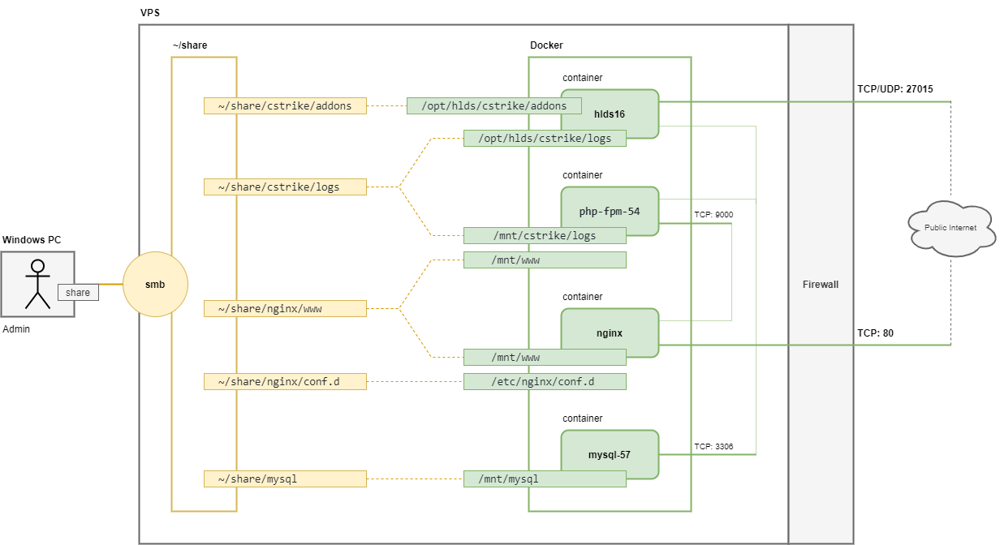

# docker-hlds16

Сервер Counter Strike v.1.6 + статистика PsychoStats v.3.2.2b.

Реализовано в Docker контейнерах на VPS в ОС Debian 11.

Для удобства, файлы из контейнеров, требующие админской правки, прокидываю в директорию ~/share на хостовой машине. В дальнейшем эту директорию можно расшарить для Windows по smb.




# Установка
Перед установкой залить на VPS директорию [share](share). Я это делаю через VSCode-плагин [SFTP](https://marketplace.visualstudio.com/items?itemName=Natizyskunk.sftp)


# 1. HLDS 1.6 сервер (контейнер hlds16:latest)
Основу взял с [counter-strike-docker](https://github.com/artem-panchenko/counter-strike-docker).

Поправил до актульного состояния, см. [Dockerfile](share/docker_images/counter-strike-docker/Dockerfile):
- **HLDS** ставится через официальный [SteamCMD](https://developer.valvesoftware.com/wiki/SteamCMD:ru), [Command_Line_Options](https://developer.valvesoftware.com/wiki/Command_Line_Options)
- **metamod** я ставлю с https://www.amxmodx.org
- **dproto** нашел самый новый, но он все равно не работает с последними версиями hlds. В пекло.
- **AMX mod X** я ставлю с http://www.amxmodx.org


Делаем image hlds16:latest
```bash
sudo docker build \
    --build-arg steam_user=STEAM_USER_HERE \
    --build-arg steam_password=STEAM_PASS_HERE \
    -t hlds16:latest \
    ~/share/docker_images/counter-strike-docker
```

В этом проекте не храню содержимое addons. Базовое содержимое addons сейчас вытащим на хостовую машину:
```bash
mkdir -p ~/share/cstrike

sudo docker run -d --name cs_tmp hlds16:latest
sudo docker cp cs_tmp:/opt/hlds/cstrike/addons ~/share/cstrike/addons
sudo docker rm -f cs_tmp

sudo chmod -R 777 ~/share/cstrike/addons

# статистика от amxx
vi ~/share/cstrike/addons/amxmodx/configs/plugins.ini
#--- раскомментарить
stats_logging.amxx
#---
```

Стартуем контейнер hlds16
```bash
sudo docker run -d \
    -e START_MAP=de_dust2_2x2 \
    -e SERVER_NAME="ars test" \
    -e ADMIN_STEAM=0:1:43198336 \
    --network host \
    -v ~/share/cstrike/addons:/opt/hlds/cstrike/addons \
    -v ~/share/cstrike/logs:/opt/hlds/cstrike/logs \
    --name hlds16 hlds16:latest

sudo docker logs hlds16
```


# 2. PsychoStats
Статистика это PHP-код + Perl-парсер логов с использованием MySQL.


# 2.1 MySQL (контейнер mysql-server:5.7)
см. [doc](https://hub.docker.com/_/mysql)

```bash
sudo docker run \
  --name mysql-57 \
  -d \
  --network=host \
  -v ~/share/mysql:/mnt/mysql \
  mysql/mysql-server:5.7
```

Создаем пользователя ***admin***
```bash
# смотрим пароль root
sudo docker logs mysql-57 2>&1 | grep GENERATED
# работаем с базой
sudo docker exec -it mysql-57 mysql -uroot -p
```

```sql
ALTER USER 'root'@'localhost' IDENTIFIED BY 'rootpass';
CREATE USER 'admin'@'%' IDENTIFIED BY 'adminpass';
GRANT ALL PRIVILEGES ON *.* TO 'admin'@'%';
FLUSH PRIVILEGES;
SELECT User, Host FROM mysql.user;
```


# 2.2 nginx (контейнер nginx:stable)
см. [doc](https://hub.docker.com/_/nginx)

```bash
sudo docker run \
  --name nginx \
  -d \
  --network=host \
  -v ~/share/nginx/www:/mnt/www \
  -v ~/share/nginx/conf.d:/etc/nginx/conf.d \
  nginx:stable

sudo docker logs nginx
```

Распаковываю проект PsychoStats
```bash
sudo apt install unzip
unzip ~/cstrike/PsychoStats_3.2.2b.zip -d ~/cstrike/
# заменяем корявые PHP-скрипты
cp -R ~/cstrike/ps/* ~/cstrike/PsychoStats-3.2.2b/upload/
# Размещаем сайт в директории ps
cp -R ~/cstrike/PsychoStats-3.2.2b/upload ~/share/nginx/www/ps
```


# 2.3 php-fpm (контейнер php-fpm-my:54)
см. [doc.](https://hub.docker.com/_/php/), 5.4 подсматривал у [johanvanhelden/dockerhero](https://hub.docker.com/r/johanvanhelden/dockerhero-php-5.4-fpm/dockerfile)

```bash
sudo docker images
sudo docker build -t php-fpm-my:54 ~/share/docker_images/php-fpm-54/

sudo docker run \
  --name php-fpm-54 \
  -d \
  --network=host \
  -v ~/share/nginx/www:/mnt/www \
  -v ~/share/cstrike/logs:/mnt/cstrike/logs \
  php-fpm-my:54

sudo docker logs php-fpm-54
```

Проверяем nxinx+php-fpm - http://65.108.82.45/index.php

Инсталируем сайт - http://65.108.82.45/ps/install/

После инсталяции настраиваю логи http://65.108.82.45/ps/admin/logsources_edit.php > /mnt/cstrike/logs


## Парсер статистики от PcychoStats
lib + stats.pl буду запускать в php-fpm контейнере

```bash
mkdir -p ~/share/nginx/www/ps/stat_parser
cp -R ~/cstrike/PsychoStats-3.2.2b/lib ~/share/nginx/www/ps/stat_parser/
cp ~/cstrike/PsychoStats-3.2.2b/stats.pl ~/share/nginx/www/ps/stat_parser/

vi ~/share/nginx/www/ps/stat_parser/stats.pl
#---
dbtype = mysql
dbhost = 127.0.0.1
dbport = 3306
dbname = psychostats3
dbuser = admin
dbpass = adminpass
dbtblprefix = ps_
#---

sudo docker exec -it php-fpm-54 bash
    apt install libdbi-perl libdbd-mysql-perl
    perl /mnt/www/ps/stat_parser/stats.pl
```

cron на хостовой машине
```bash
sudo crontab -e
#---
* * * * * docker exec php-fpm-54 /usr/bin/perl /mnt/www/ps/stat_parser/stats.pl 1>/dev/null 2>&1
#---
```


## 2.4 Подчищаем
```bash
rm -rf ~/share/nginx/www/ps/install
rm -rf ~/cstrike/PsychoStats-3.2.2b
rm -f ~/cstrike/Readme~.txt
rm -f ~/share/nginx/www/index.php
```


# 3 Доводка тюнинг HLDS сервера

## 3.1 Конфиги сервера
Подсматривал server.cfg [тут](https://goldsrc.ru/threads/1594/).

1. Залить модифицированные конфиги из директории [cstrike](cstrike) на VPS.
2. Закинуть их в контейнер:
```bash
sudo docker cp ~/cstrike/server.cfg hlds16:/opt/hlds/cstrike/server.cfg
sudo docker cp ~/cstrike/mapcycle.txt hlds16:/opt/hlds/cstrike/mapcycle.txt
sudo docker cp ~/cstrike/motd.txt hlds16:/opt/hlds/cstrike/motd.txt
sudo docker cp ~/cstrike/hlds_run.sh hlds16:/bin/hlds_run.sh
```

## 3.2 Быстрая скачка

Выкладываю ресурсы из cstrike на nginx:
```bash
mkdir ~/share/nginx/www/cstrike
sudo docker cp hlds16:/opt/hlds/cstrike/maps ~/share/nginx/www/cstrike/maps
```

# 3.3 Тюнинг AMXX

Тут надо накидать всяких плагинов и настроить их конфиги...

```bash
# админы
vi ~/share/cstrike/addons/amxmodx/configs/users.ini
# amx
vi ~/share/cstrike/addons/amxmodx/configs/amxx.cfg
# sql
vi ~/share/cstrike/addons/amxmodx/configs/sql.cfg

# restart
sudo docker restart hlds16
```


# amxx plugins

## Парашют
https://cs-mod.ru/load/plaginy_dlja_cs_1_6/servernye/plagin_parashjut_dlja_ks_1_6/98-1-0-220
```bash
cp ~/cstrike/addons/amxmodx/plugins/amx_parachute.amxx ~/share/cstrike/addons/amxmodx/plugins/
cp ~/cstrike/addons/amxmodx/scripting/amx_parachute.sma ~/share/cstrike/addons/amxmodx/scripting/
```

## Урон
https://cs-mod.ru/load/plaginy_dlja_cs_1_6/statistika/plagin_damager_dlja_cs_1_6/95-1-0-165
```bash
cp ~/cstrike/addons/amxmodx/plugins/damager.amxx ~/share/cstrike/addons/amxmodx/plugins/
cp ~/cstrike/addons/amxmodx/scripting/damager.sma ~/share/cstrike/addons/amxmodx/scripting/
```

## rtv
http://www.4cw.ru/cs/pluginscs/71-plagin-rtv-dlya-cs-16-rockthevote.html
```bash
cp ~/cstrike/addons/amxmodx/plugins/rockthevote_custom.amxx ~/share/cstrike/addons/amxmodx/plugins/
cp ~/cstrike/addons/amxmodx/scripting/rockthevote_custom.sma ~/share/cstrike/addons/amxmodx/scripting/
vi ~/share/cstrike/addons/amxmodx/configs/amxx.cfg
#--
amx_timevote 1
amx_howmanypercentage 0.3
amx_howmanyvotes number 2
amx_directmapchange 1
#--
```

## kill - синий фон
https://cs-mod.ru/load/plaginy_dlja_cs_1_6/ehffekty/plagin_blue_fade_sinevatyj_ehkran_pri_ubijstve_cs_1_6/97-1-0-440
```bash
cp ~/cstrike/addons/amxmodx/plugins/Blue_Fade.amxx ~/share/cstrike/addons/amxmodx/plugins/
cp ~/cstrike/addons/amxmodx/scripting/Blue_Fade.sma ~/share/cstrike/addons/amxmodx/scripting/
```

## Рестарт
```bash
vi ~/share/cstrike/addons/amxmodx/configs/plugins.ini
#--
;nextmap.amxx         ; OFF
;mapchooser.amxx      ; OFF
amx_parachute.amxx
damager.amxx
Blue_Fade.amxx
rockthevote_custom.amxx
#--

sudo docker restart hlds16
```
